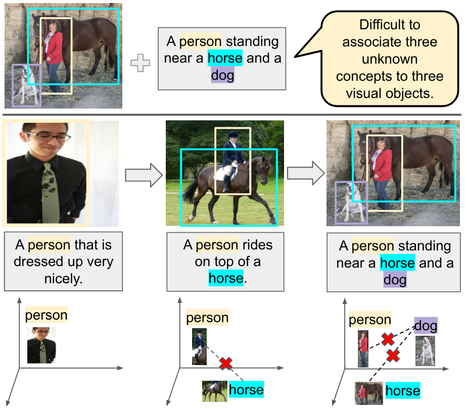

# Learning from Children: Improving Image-Caption Pretraining via Curriculum

This repository provides the official implementation of our ACL 2023 Findings paper titled, Learning from Children: Improving Image-Caption Pretraining via Curriculum. The code is built on top of [Open Vocabulary Object Detection](https://github.com/alirezazareian/ovr-cnn). We appreciate the work of the authors in this valuable project.



## Installation

Create environment and set up data as instructed in this [repo](https://github.com/alirezazareian/ovr-cnn); with this exception -- install PyTorch version 1.2.0 instead of PyTorch 1.0 nightly. 

### Generating Curriculum Data
Generate curriculum data by running this [notebook](ipynb/coco_img_cap_dataset_divide_into_phases.ipynb).

## Do image-caption pretraining on COCO captions dataset via curriculum

For 4 gpus:
```bash
python -m torch.distributed.launch --nproc_per_node=4 --master_port 6254 tools/train_net.py --skip-test --config-file configs/mmss_rcnn_v01_4x_cur_rs.yaml OUTPUT_DIR runs/
```

## Train baseline for the same config
Run the above command with the following changes in configs/mmss_rcnn_v01_4x_cur_rs.yaml:
- CURRICULUM.DO = False
- Comment out MODEL.MMSS_HEAD.GROUNDING.ALIGNMENT_CURRICULUM


## Evaluation
You can evaluate using a similar command as above, by running [`tools/test_net.py`](tools/test_net.py).


## License

This repository is released under the MIT license. See [LICENSE](LICENSE) for additional details.
